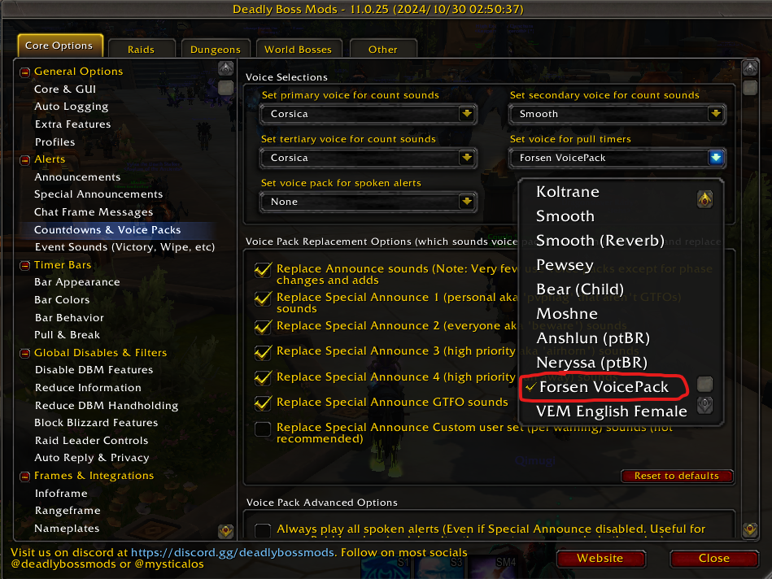
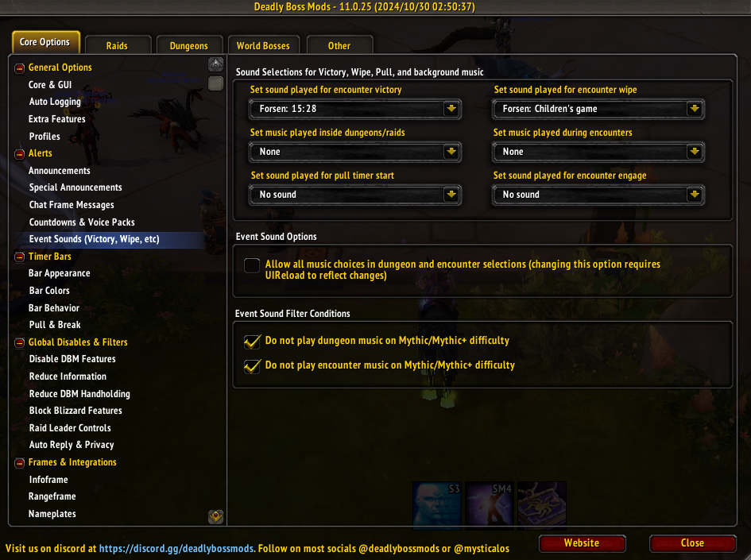

# Forsen Voice Pack

Forsen is able to count to 10 without his MOM's help  

## About

This is a custom countdown DBM voice pack using [enlyth's "baj-tts"](https://github.com/enlyth/baj-tts) 

## Installation

Drag and drop the folder called "DBM-VPForsen" into your World of Warcraft Addons folder "World of Warcraft\_retail_\Interface\AddOns\" 

Head in game and type /dbm, under "Core options > Alerts, click "Countdowns & Voice Packs", Change "Set voice for pull timers" to "Forsen VoicePack"

If you also want to enable Victory and/or Deafeat sounds you can do it by selecting the "Event Sounds" and using the drop down menus

## Join ta guild today!

# Credits
made by me :) /Criizp

Again huge thanks to [enlyth's "baj-tts"](https://github.com/enlyth/baj-tts) for making this voicepack possible.
